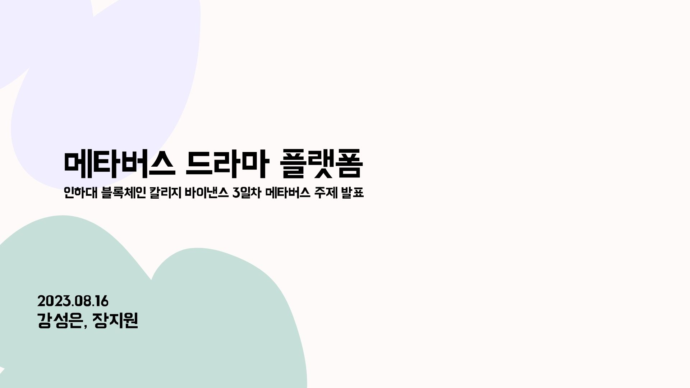
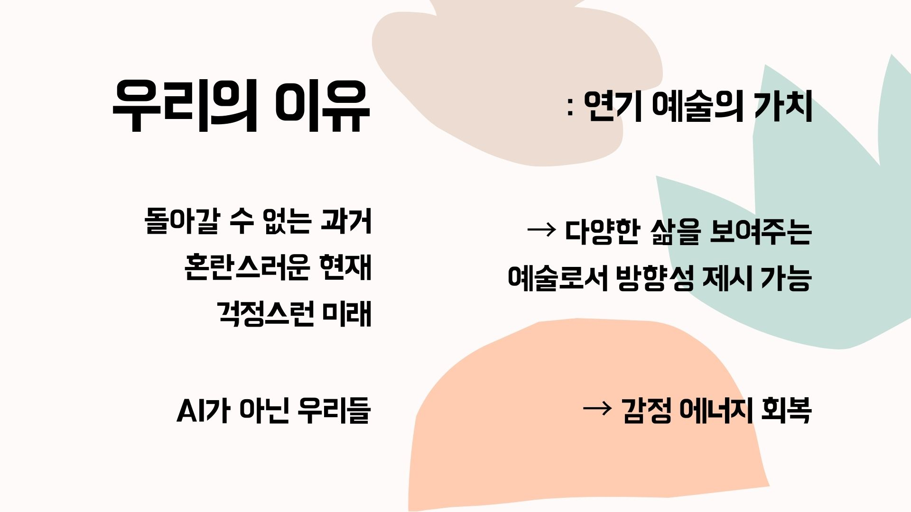
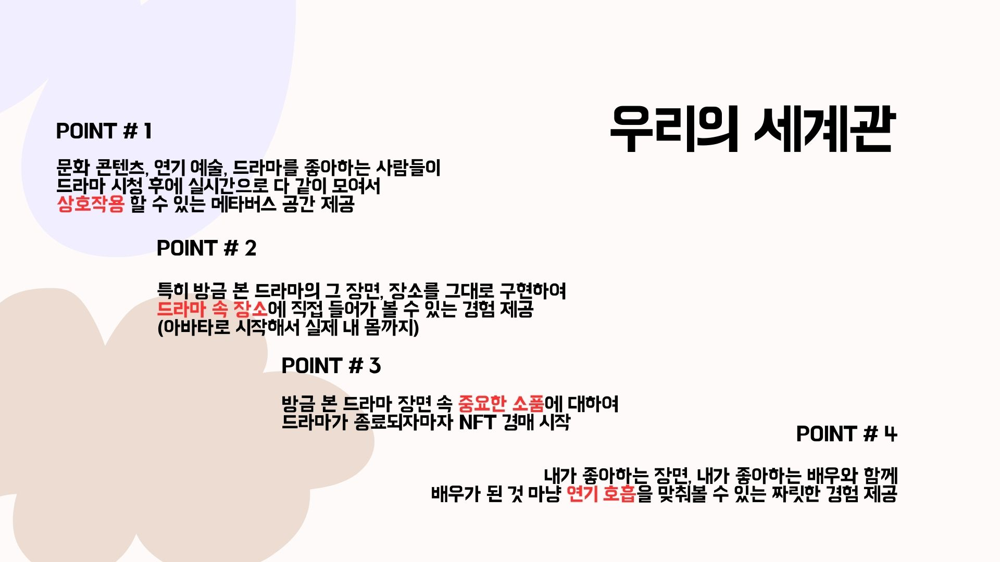
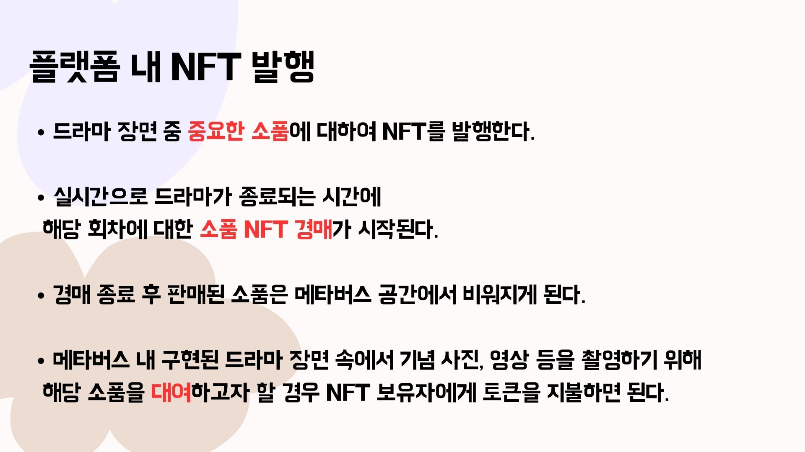

# Binance-study-inha-2023-Metaverse-BM

PPT 자료 링크 (CANVA)
https://www.canva.com/design/DAFrrtyggnQ/txLnr23XXX5mMpLx_BZLmA/view?utm_content=DAFrrtyggnQ&utm_campaign=designshare&utm_medium=link&utm_source=publishsharelink

혹시 다들 인생 드라마 있으신가요?

저희는 `메타버스 드라마 플랫폼`을 기획해보았습니다.

드라마 덕후들을 위한 공간을 메타버스 안에 설계해보자는 프로젝트입니다.

이 프로젝트의 목적은 사회, 경제, 문화 분야 중에서 `문화 구축`을 타겟으로 설계하였습니다.

이번 블록체인 칼리지에서 김정은 센터장님 강의 중에 인상 깊었던 키워드는 VALUE, 가치였습니다.

- 어떤 가치를 추구할 것인가?
- 어떤 가치를 추구하는 사람들끼리 모일 수 있는 커뮤니티를 형성할 것인가?

그렇다면 나는 어떤 가치를 추구하지?

나는 어떤 가치를 추구하는 사람들이 모인 커뮤니티에서 활동을 하고 싶나?

생각해보았을 때 가장 먼저 떠오른 것이 `연기 예술`이었습니다.

## 저는 연기 예술을 사랑합니다.

1. 우리는 모두 `단 한 번 뿐인 인생`을 살아갑니다.

    그렇기 때문에 돌아갈 수 없는 과거와 혼란스러운 현재와 걱정스러운 미래가 있습니다.

    이에 연기 예술은 다양한 삶을 보여주는 예술로서 `방향성`을 제시해줄 수 있다고 생각합니다.

2. 또한 AI가 아닌 우리들은 `감정 에너지`를 갖고 있습니다.

    이러한 감정 에너지는 끊임 없이 소모되고 에너지가 없으면 우리들을 생산적인 활동을 할 수 없습니다.

    이에 연기 예술은 감정 에너지를 환기시킬 수 있고 북돋아줄 수도 있다고 생각합니다.

    그래서 선택했습니다.

## 우리의 핵심 포인트

1. 저희의 가장 핵심 포인트는 문화 콘텐츠, 연기 예술, 그 중에서도 드라마를 좋아하는 유저들이 드라마 시청 후에도 한 공간에서 마음껏 실시간으로 `상호작용 할 수 있는 메타버스의 공간`을 만들어주자는 것입니다.

2. 두 번째, 그 공간을 `방금 본 드라마의 장면 속 장소`로 그대로 구현해내자입니다.

    그래서 드라마 장면 속에 내가 실제로 들어가서 다른 유저들과 실시간으로 커뮤니케이션을 나눌 수 있는 생동감 있는 경험을 제공하고자 했습니다.

3. 세 번째, 방금 본 드라마 장면 속의 `중요한 소품`에 대해서 드라마가 종료되자마자 `NFT 경매`를 시작하는 것입니다.

    이러한 시스템으로 커뮤니티에 대한 소속감, 그리고 접속하고 싶게 만드는 매력도를 어필하여 보다 활성화 하고자 했습니다.

4. 마지막으로 이 드라마라는 문화 콘텐츠, 연기 예술, 이 드라마에 나오는 배우들이 너무 좋아서 참여하게 된 유저들이라면, 내가 좋아하는 장면, 내가 좋아하는 배우와 연기를 해볼 수 있는 게 너무도 가치 있는 경험이 될 것이라고 생각했습니다.

    그래서 `내가 마치 배우가 된 것처럼` 그 장면 속으로 들어가서 내가 좋아하는 배우가 다름 아닌 나를 바라보고 있고 나를 향해 말하고 있는 상황에서 내가 `연기`를 하고 실시간으로 다른 유저들에게 리액션도 받을 수 있는 짜릿한 경험을 제공하고자 했습니다.

## 우리의 NFT 발행

중요한 소품을 `NFT화` 하여 토큰이 순환될 수 있도록 설계해보았습니다.

- NFT 경매 참여
- NFT 거래
- NFT 대여
  

## 우리의 토큰 발행

사회, 경제, 문화 중 문화에 가장 집중하여 가치를 형성하고자 했던 만큼 커뮤니티에 가장 큰 비중을 두었습니다.

다음으로 드라마는 굉장히 큰 비용이 들어가는 프로젝트인 만큼 `사전 제작` 시에 그 비용을 투자한 사람들에게 토큰을 발행해주는 것도 생각해보았습니다.

그리고 이 플랫폼의 흥망성쇠는 드라마의 흥행과 함께하고, 어쩌면 드라마의 흥행도 이 플랫폼의 흥망성쇠와 함께 할 수 있기 때문에, 초기 커뮤니티 형성을 위해 인플루언서 등을 활용하여 `홍보`하는 방안도 고려해보았습니다.

## 우리의 토큰 활용

이러한 멀티버스 공간에 접속하고 다른 유저들과 실시간으로 커뮤니케이션 하는 것은 누구든지 가능하지만, 커뮤니티에서 좀 더 활동하기 위해서는 토큰이 필요합니다.

`토큰을 받기 위한 요건`으로는 다음과 같이 설계하여 토큰의 발급과 동시에 커뮤니티가 보다 활성화 될 수 있도록 하였습니다.

이렇게 발급 받은 토큰은 `배우와의 연기 체험 및 촬영`, `소품에 대한 NFT 경매 참여 및 거래`를 위해 사용될 수 있습니다.

또한 토큰을 오랫동안 소유한 유저에게는 배우, 작가, 감독 등과 함께 모여 후토크도 하고 사인도 받을 수 있는 행사 참여, 사인이 담긴 대본집 증정 등의 혜택을 주고자 했습니다.

## 우리의 플랫폼 확장

마지막으로 플랫폼을 확장하여, `미스터 선샤인` 같은 경우에는 조선 시대 속으로 들어가서 한복을 입고 활동할 수 있는 커뮤니티, `오징어 게임` 같은 경우에는 유저들이 다 같이 실시간으로 게임을 하면서 상호작용 할 수 있는 커뮤니티도 한 번 생각해보았습니다.

감사합니다.